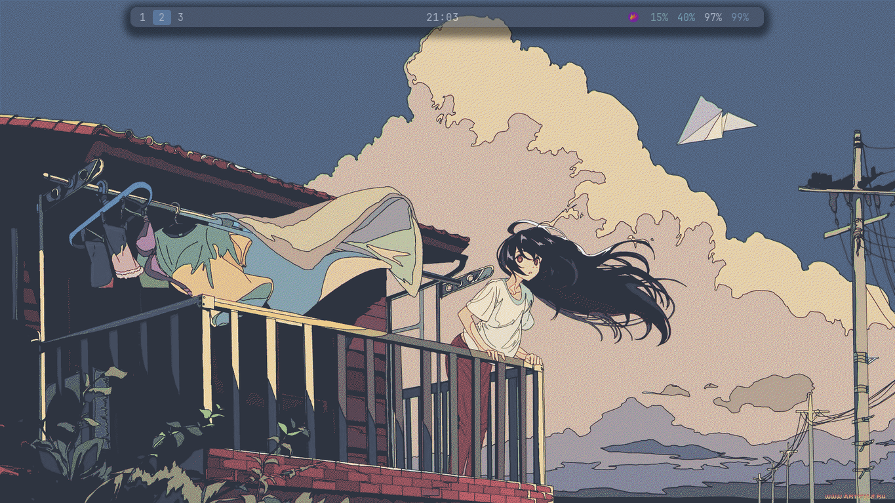
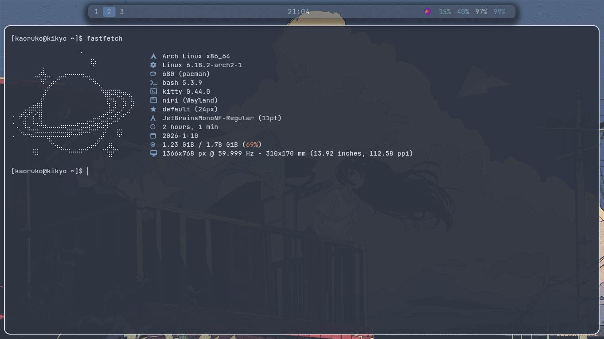
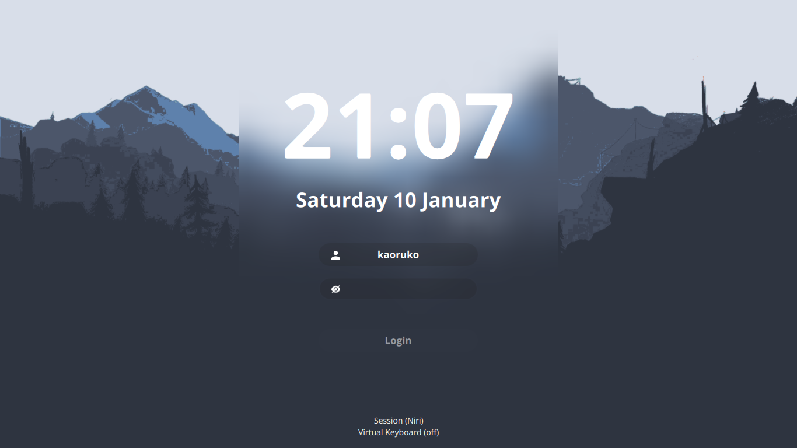

# 🍙 Meu Niri Rice (Arch Linux)

Minhas configurações pessoais (dotfiles) para o **Niri** compositor no Arch Linux. Focado em minimalismo e produtividade.

## 📸 Screenshots


*Desktop*


*Fastfetch*


*SDDM/Login*

---

## 🚀 Instalação Automática

Se você já tem uma instalação limpa do Arch Linux, basta rodar **um único comando** no terminal. 

O script vai:
1. Instalar dependências (Niri, Waybar, etc).
2. Configurar o AUR helper (yay).
3. Aplicar temas e configs.
4. Configurar o SDDM (Tela de login).

**Copie e cole:**

**Arch Linux**
```bash
curl -s https://raw.githubusercontent.com/51jota/dots/main/install.sh | bash
```
**Void Linux**
```bash
curl -s https://raw.githubusercontent.com/51jota/dots/main/installvoid.sh | bash
```
Nota: Reinicie o computador após a instalação terminar.

🛠️ Apps:  
WM: Niri  
Barra: Waybar  
Terminal:	Kitty  
Browser: Firefox  
Launcher: Tofi  
Login (DM):	SDDM  
Notificações:	Dunst  
File Manager: Superfile/Nautilus  

⌨️ Atalhos Principais:  
Super + Enter: Kitty  
Super + Space: Tofi  
Super + Esc: PowerMenu  
Super + B: Firefox  
Super + F: Maximizar Janela  
Super + W: Fechar Janela  
Super + Shift + W: Trocar Wallpaper   
Super + Minus: Wifi  
Super + Shift + Minus: Bluetooth  
